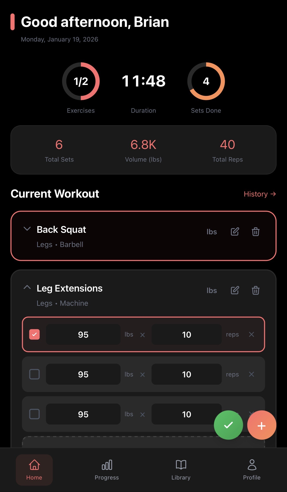
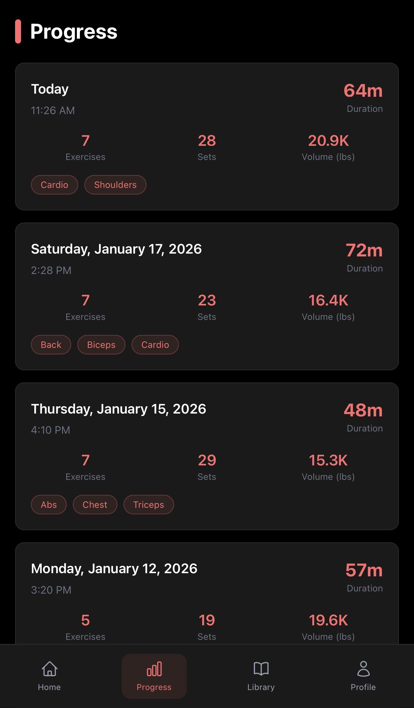
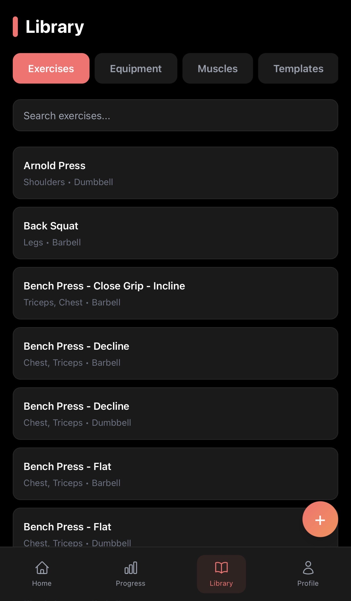
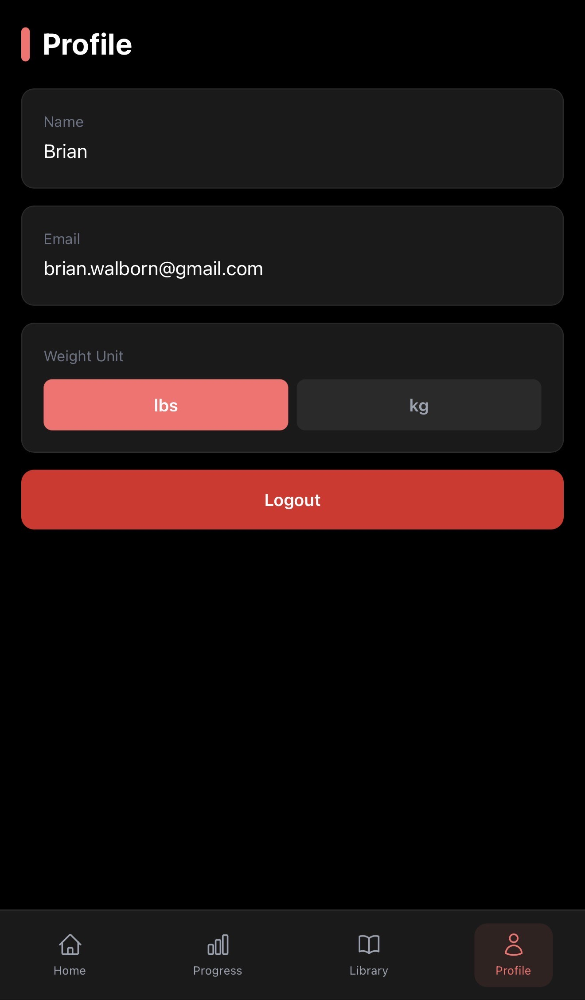

# Rep Mate

A modern, full-stack workout tracking application built with Vue 3 and FastAPI. Designed to be self-hosted, Rep Mate gives you complete control over your fitness data while providing an intuitive, mobile-first interface to track workouts, monitor progress, and achieve your fitness goals.

## Features

### 🔒 Self-Hostable

- **Complete data ownership** - your workout data stays on your infrastructure
- **Privacy-first design** - no third-party tracking or data sharing
- **Docker-ready** with single-command deployment
- **Full control** over backups, updates, and data retention

### 🏋️ Workout Tracking

- **Real-time workout logging** with live timer and progress tracking
- **Exercise library** with customizable exercises and equipment types
- **Set management** with weight, reps, and completion tracking
- **Collapsible exercise cards** for better screen space management
- **Progress rings** showing exercises completed and sets done



### 📊 Progress History

- **Comprehensive workout history** with detailed exercise breakdowns
- **Volume tracking** with automatic calculations
- **Date-based organization** with visual workout summaries
- **Muscle group tags** for quick reference
- **Exercise notes** for tracking form cues and observations



### ⚖️ Flexible Unit System

- **Global weight unit preference** (lbs or kg) configurable in profile
- **Per-exercise unit selection** for mixed training styles
- **Automatic conversions** between lbs and kg
- **Consistent storage** (all weights stored in lbs, converted for display)
- **Smart volume formatting** with decimal precision for kg

### 🏃 Cardio Support

- **Dedicated cardio mode** for treadmill and bike exercises
- **Notes-based tracking** instead of reps/weight
- **Time and intensity logging** via exercise notes

### 📚 Exercise Library

- **Pre-loaded equipment types** (Barbell, Dumbbell, Cable, Kettlebell, Bodyweight, Treadmill, Bike)
- **Custom exercise creation** with muscle group selection
- **Equipment-based organization**
- **Archived exercise management**



### 👤 User Profile

- **Personal settings management**
- **Weight unit preferences**
- **Secure authentication** with JWT tokens



## Tech Stack

### Frontend

- **Vue 3** with Composition API
- **Tailwind CSS** for styling
- **Vue Router** for navigation
- **Vite** for fast development and building
- **Heroicons** for UI icons

### Backend

- **FastAPI** for high-performance REST API
- **SQLAlchemy** for ORM
- **Alembic** for database migrations
- **PostgreSQL** for data persistence
- **JWT** for authentication
- **Pydantic** for data validation

### DevOps

- **Docker & Docker Compose** for containerization
- **GitHub Actions** for CI/CD
- **Multi-platform builds** (amd64, arm64)
- **Kubernetes-ready** deployment

## Getting Started

### Prerequisites

- Docker and Docker Compose
- Node.js 20+ (for local frontend development)
- Python 3.11+ (for local backend development)

### Quick Start with Docker

1. Clone the repository:
```bash
git clone https://github.com/brianwalborn/rep-mate.git
cd rep-mate
```

2. Start the application:
```bash
docker compose up --build
```

3. Access the application:
- Frontend: http://localhost:5173
- Backend API: http://localhost:8000
- API Documentation: http://localhost:8000/docs

### Local Development

See [SETUP.md](docs/SETUP.md) for detailed local development setup instructions.

## Project Structure

```
rep-mate/
├── frontend/           # Vue 3 frontend application
│   ├── src/
│   │   ├── components/ # Reusable UI components
│   │   ├── views/      # Page components
│   │   ├── composables/# Vue composables
│   │   ├── services/   # API service layer
│   │   └── utils/      # Utility functions
│   └── Dockerfile
├── backend/            # FastAPI backend application
│   ├── app/
│   │   ├── models/     # SQLAlchemy models
│   │   ├── schemas/    # Pydantic schemas
│   │   ├── routers/    # API route handlers
│   │   ├── crud/       # Database operations
│   │   └── auth/       # Authentication logic
│   ├── alembic/        # Database migrations
│   └── Dockerfile
├── docs/               # Documentation
├── screenshots/        # Application screenshots
└── docker-compose.yml  # Multi-container setup
```

## Key Features in Detail

### Smart Weight Unit System

Rep Mate features a sophisticated weight unit system that allows you to:
- Set a global preference for lbs or kg in your profile
- Override the unit per-exercise during workouts
- Automatically converts kg to lbs for consistent database storage
- Displays weights in their original logged unit in history
- Calculates total volume in your preferred unit

### Exercise Notes

Add contextual notes to any exercise in your workout:
- Track form cues and technique reminders
- Log intensity or difficulty
- Record cardio metrics (speed, incline, resistance)
- Notes persist with workout history

### Collapsible Workout Cards

Keep your workout view clean and organized:
- Collapse exercises you're not currently working on
- State persists across tab switches
- Quick expand/collapse with a single tap

## Database Schema

The application uses PostgreSQL with the following main tables:
- `users` - User accounts and preferences
- `exercises` - Exercise library
- `equipment` - Equipment types
- `workouts` - Workout sessions
- `workout_exercises` - Exercises in a workout
- `sets` - Individual sets with weight, reps, and unit

## API Documentation

Once the backend is running, visit http://localhost:8000/docs for interactive API documentation powered by Swagger UI.

## Contributing

Contributions are welcome! Please feel free to submit a Pull Request.

## License

This project is open source and available under the MIT License.
